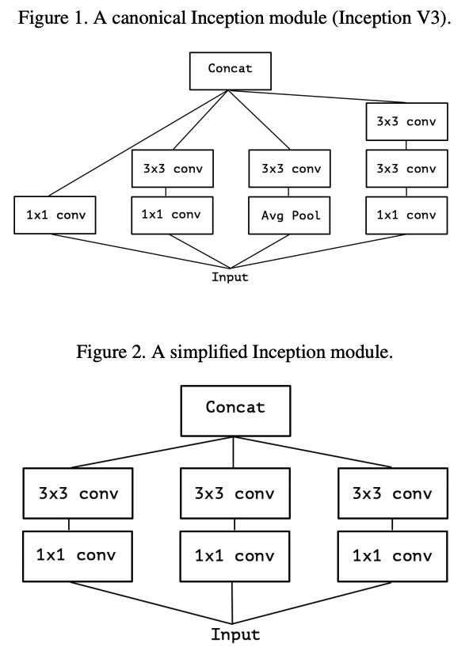

[TensorFlow 2] Going Deeper with Convolutions | Simplified Version
=====

## Concept
<div align="center">
    
  <p> The Inception module [1, 2].</p>
</div>

## Performance

|Indicator|Value|
|:---|:---:|
|Accuracy|0.-----|
|Precision|0.-----|
|Recall|0.-----|
|F1-Score|0.-----|

```
Confusion Matrix
```

## Requirements
* Python 3.7.6  
* Tensorflow 2.1.0  
* Numpy 1.18.1  
* Matplotlib 3.1.3  

## Reference
[1] Christian Szegedy et al. (2015). <a href="https://www.cv-foundation.org/openaccess/content_cvpr_2015/html/Szegedy_Going_Deeper_With_2015_CVPR_paper.html">Going Deeper With Convolutions</a> Proceedings of the IEEE Conference on Computer Vision and Pattern Recognition (CVPR), 2015, pp. 1-9  
[2] François Chollet (2016). <a href="https://arxiv.org/abs/1610.02357">Xception: Deep Learning with Depthwise Separable Convolutions</a>. arXiv preprint arXiv:1610.02357.
